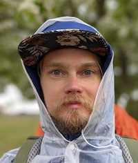

## Andrei Chenchik, iOS Software Engineer

Solving hard challenges with real solutions.  Solving hard challenges with real solutions. Solving hard challenges with real solutions.  Solving hard challenges with real solutions.  

Looking for a starting position as iOS developer to help build and ship great apps, help users and to improve my iOS platform knowledge.

**Visa and Location**: Spain residency and work permit, live in Barcelona.
  **Languages**: English `B2`, Spanish `A1` (como un niño de tres años)
  **Contacts**: [andrei@chenchik.me](mailto:andrei@chenchik.me), [+34 635 317 389](tel:+34635317389), [github.com/AndreiChenchik](https://github.com/AndreiChenchik), [linkedin.com/in/achenchik](https://www.linkedin.com/in/achenchik)

##### **What I do, with examples**
- Mobile using `Swift` with `UIKit` or `SwiftUI`: [Simply Receipts](https://github.com/AndreiChenchik/receipt)
- Backend using `Python` with `FastAPI`, `GraphQL`, `Postgres` and `Reddis`: [enableOps api](https://github.com/enableops/api-service)
- Web Frontend using `JS/TS` with `React`: [enableOps website](https://github.com/enableops/enableops.github.io/tree/main/src/components)
- DevOps, CI&CD using `Pulumi`, `ArgoCD`, `GH Actions` and `Kubernetes`: [local GitOps & IaaC](https://github.com/AndreiChenchik/local-cluster)
- Data, ML&DL using `Python` with `Pandas`, `Numpy`, `PyTorch`: [Simpsons DeepLearning](https://github.com/AndreiChenchik/dlschool/blob/main/14.1%20%D0%94%D0%BE%D0%BC%D0%B0%D1%88%D0%BD%D0%B5%D0%B5%20%D0%B7%D0%B0%D0%B4%D0%B0%D0%BD%D0%B8%D0%B5.%20%D0%BA%D0%BB%D0%B0%D1%81%D1%81%D0%B8%D1%84%D0%B8%D0%BA%D0%B0%D1%86%D0%B8%D1%8F%20%D0%A1%D0%B8%D0%BC%D0%BF%D1%81%D0%BE%D0%BD%D0%BE%D0%B2/simpsons_resnet50.ipynb)

##### **Latest project: Simply Receipts ([AppStore](https://apps.apple.com/app/simply-receipts-tracker/id1586132989), [GitHub](https://github.com/AndreiChenchik/receipt), [Blog](https://chenchik.me/simply-receipts))**

Looking for a starting position as iOS developer to help build and ship great apps, help users and to improve my iOS platform knowledge.Looking for a starting position as iOS developer to help build and ship great apps, help users and to improve my iOS platform knowledge.Looking for a starting position as iOS developer to help build and ship great apps, help users and to improve my iOS platform knowledge.

##### **Experience**
* Co-Founder and Backend developer at enableOps, `Jan 2021 - Present`: Looking for a starting position as iOS developer to help build and ship great apps, help users and to improve my iOS platform knowledge.
* Product Manager at TruBe, `Jan 2021 - Present`: Looking for a starting position as iOS developer to help build and ship great apps, help users and to improve my iOS platform knowledge.
* Product Manager at ABBYY, `Jan 2021 - Present`: Looking for a starting position as iOS developer to help build and ship great apps, help users and to improve my iOS platform knowledge.
* Product Manager at Oktos.io, `Jan 2021 - Present`: Looking for a starting position as iOS developer to help build and ship great apps, help users and to improve my iOS platform knowledge.
* Lead Frontend Developer at Acronis, `Jan 2021 - Present`: Looking for a starting position as iOS developer to help build and ship great apps, help users and to improve my iOS platform knowledge.

---

*__FUN FACTS__: Have a [blog](https://chenchik.me). Did 400km of Camino de Santiago in [2022](https://storyteller.fit/album/384). Speak Russian. Run 2021km in [2021](https://www.strava.com/athletes/44250763). Was 34 in 2022. Do long bike [rides](https://www.strava.com/activities/4836441053). Born in imaginary land - [Transnistria](https://en.wikipedia.org/wiki/Transnistria). Have twitter [@AndreiChenchik](https://twitter.com/AndreiChenchik).*